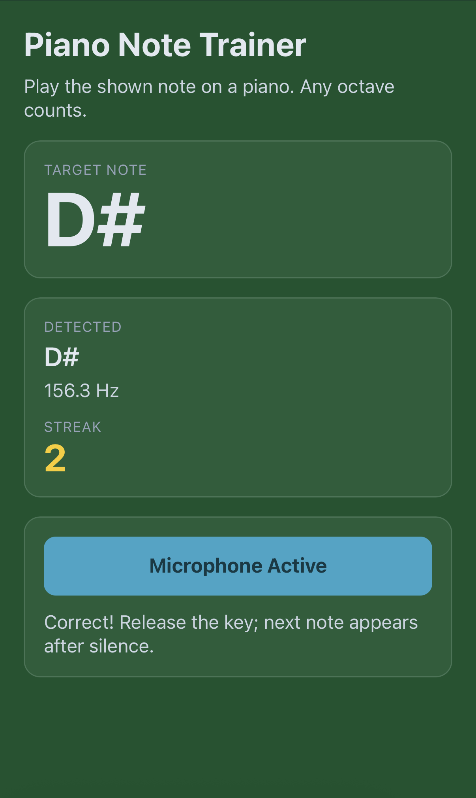
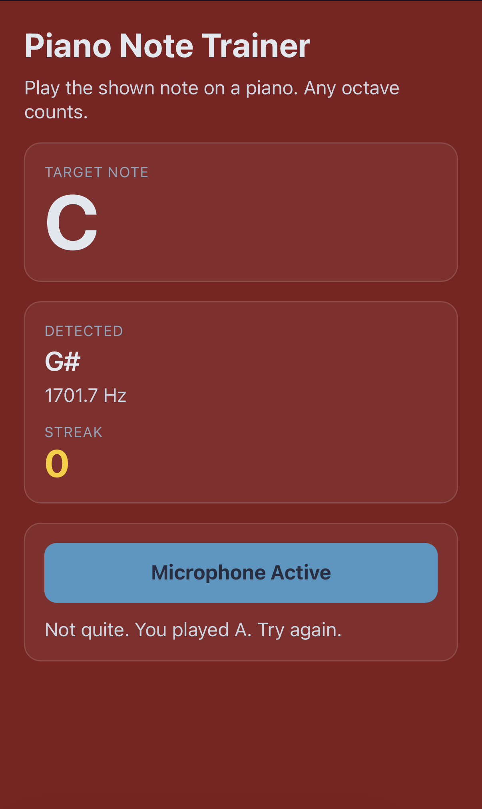

# Piano Notes Trainer

A mobile-friendly web app that helps students learn piano note names by ear and instrument feedback.

## How it works

1. A target note (for example `F` or `C#`) appears on screen.
2. The app listens through the microphone and estimates pitch (Hz) using A440 tuning.
3. The detected note is compared against the target note (octave does not matter).
4. If correct, the screen flashes green and the streak increases.
5. If incorrect, the screen flashes red and the streak resets.

## Features

- Real-time microphone pitch detection in the browser
- Note matching by pitch class (octave-agnostic)
- Green/red feedback states for quick reinforcement
- Streak counter for lightweight gamification
- Mobile-first UI for phone/tablet practice

## Run locally

Use any static file server from the project root:

```bash
python3 -m http.server 8000
```

Then open `http://localhost:8000`.

## Deploy

This project is static and can be hosted directly on GitHub Pages.

Live app: [https://lukasolson.github.io/piano-notes/](https://lukasolson.github.io/piano-notes/)

## Screenshots

### Correct answer (green flash)



### Incorrect answer (red flash)


