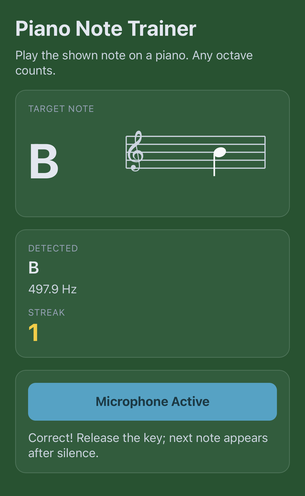
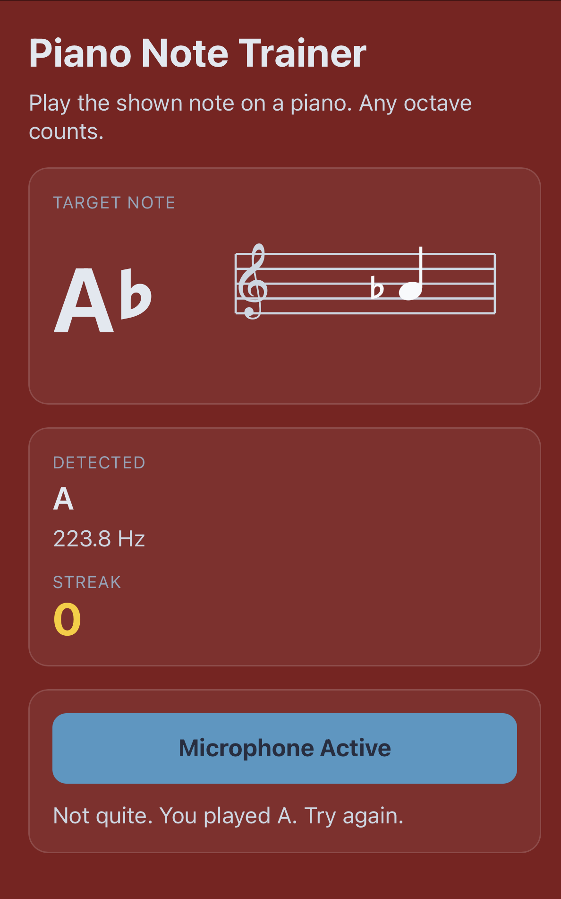

# Piano Notes Trainer

A mobile-friendly web app that helps students learn piano note names by ear and instrument feedback.

## How it works

1. Choose a display mode:
   - `Note Name`: shows the note text (for example `F#` or `B♭`).
   - `Staff`: shows notation on a staff and reveals a clef selector (`Treble` / `Bass`).
2. The app listens through the microphone and estimates pitch (Hz) using A440 tuning.
3. A detection only counts after the note is stable (within a small Hz tolerance) for a short time window.
4. Matching rules depend on mode:
   - `Note Name`: octave does not matter (pitch class + enharmonic matching).
   - `Staff`: exact written pitch is required (correct octave).
5. In `Staff` mode, target notes are constrained to one line below through one line above the selected clef.
6. If correct, the screen flashes green, streak increases, and the app waits for silence before showing the next note.
7. If incorrect, the screen flashes red and streak resets.

## Features

- Real-time microphone pitch detection in the browser
- Consistency-gated note detection to reduce noisy false triggers
- Dual training modes: `Note Name` and `Staff`
- `Note Name` mode uses octave-agnostic, enharmonic-aware matching
- `Staff` mode requires exact written pitch (includes octave)
- Clef selection in staff mode (`Treble` / `Bass`)
- Staff-mode target range constrained to one line below through one line above the staff
- Target notes include naturals, sharps, and flats (`♭`)
- Staff notation rendering with accidentals and stems for each target note
- Shuffled note-pool cycling so every note appears before repeating
- Green/red feedback states for quick reinforcement
- Streak counter for lightweight gamification
- Mobile-first UI for phone/tablet practice

## Run locally

Use any static file server from the project root:

```bash
python3 -m http.server 8000
```

Then open `http://localhost:8000`.

## Deploy

This project is static and can be hosted directly on GitHub Pages.

Live app: [https://lukasolson.github.io/piano-notes/](https://lukasolson.github.io/piano-notes/)

## Screenshots

### Correct answer (green flash)



### Incorrect answer (red flash)



## Cursor build transcript

Built as a live example of what Cursor can generate iteratively through prompts and refinements.

The exported chat used to build and refine this app is available in `cursor.md`.
